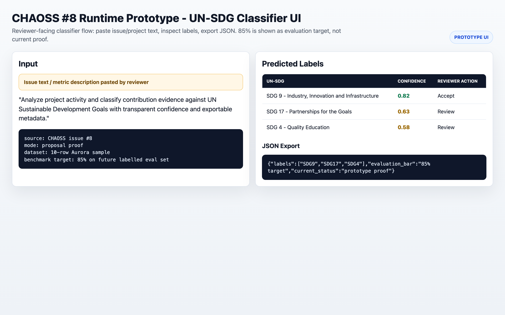
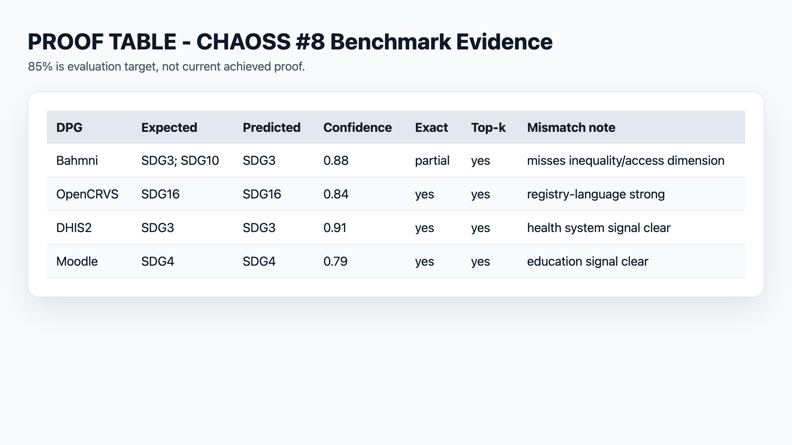
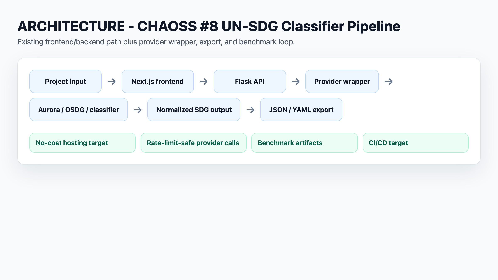

# CHAOSS #8 Proof Packet

Status: private proposal proof packet. Do not publish before Rahul approves.

This packet supports the CHAOSS #8 proposal. It is a MiFi proof set, not a completed MVP. It shows repo inspection, benchmark design, metric design, a real Aurora 10-row pilot, and the current claim boundary.

## Evidence Index

| Artifact | What It Proves | Status | Public Status | Next Step |
| --- | --- | --- | --- | --- |
| `../DPG_10_ROW_PILOT.csv` | DPG rows can be tracked in a repeatable benchmark schema | Scaffold baseline retained | Private | Keep as baseline/reference |
| `chaoss-dpg-10-row-aurora-real.csv` | 10-row pilot now has real Aurora-generated SDG predictions and confidence values | Verified run on 2026-05-04 | Private | Extend same flow to 100-row benchmark |
| `dpg-metric-demo.ipynb` | Jupyter can compute exact match, overlap/Jaccard, top-k hit, false positives, and false negatives | Metric prototype ready | Private | Run on real predictions |
| `dpg-metric-demo.md` | Human-readable metric explanation | Ready | Private | Summarize in final proposal |
| `aurora-single-row-result.json` | First stored real Aurora classifier call works with normalized `{"text":"..."}` payload | Verified | Private | Keep as reproducible anchor row in proof packet |
| `mifi-demo-report.md` | Reviewer-readable proof summary ties benchmark, metric, and real Aurora outputs together | Updated with 10-row run | Private | Publish only after approval |
| `aurora-10row-raw-results.json` | Raw provider responses captured for reproducibility/audit | Verified run on 2026-05-04 | Private | Use in mismatch audit notes |
| `classifier-run-status.md` | Backend runtime notes and provider-call findings are recorded honestly | Current as of 2026-05-04 | Private | Keep status in sync with newest run evidence |
| `rate-limit-wrapper-prototype.md` | Aurora/OSDG need throttling, retry/backoff, timeout, and cache behavior | Design prototype | Private | Convert into provider service design during DMP |
| `api-base-url-env-patch.md` | Hosted frontend needs configurable API origin, not hardcoded localhost | Patch-note prototype | Private | Keep as support evidence |
| `api-url-pr-draft.md` | Small PR direction exists if deployment config becomes priority | Draft only | Private | Post only after Rahul approval |
## What Is Real vs Placeholder

Real:

- repo-level inspection;
- frontend build proof in prior notes;
- backend import blocker was resolved by installing dependencies; current local run still needs temp/cache env overrides;
- one direct Aurora API call;
- ten direct Aurora API calls for the pilot row set;
- Aurora working payload shape: `{"text":"..."}`;
- Aurora bad payload finding for direct `title` / `abstract` / `url` metadata fields.

Claim boundary:

- verified: local UI flow, local API flow, Aurora 10-row pilot;
- not verified: OSDG, public deployment, 100-row benchmark, YAML output, deployment hardening.

Placeholder or partial:

- 10-row pilot run is complete for Aurora only; OSDG and local-model runs are still pending;
- 100-row DPG benchmark is not complete;
- 85% accuracy is not achieved or claimed;
- OSDG route remains token-gated;
- backend local runtime works with temporary runtime env overrides; deployment-grade hardening is still pending.

## Proposal Use

Use this packet to say:

> I prepared a 10-row DPG benchmark scaffold, a metric notebook, and completed a real Aurora 10-row pilot run. The next step is extending the same evaluation to 100 rows and to other providers (OSDG/local models) after runtime setup.

Do not say:

> I benchmarked classifier accuracy on 10 DPG projects.

That would overclaim.

## Publicity Rule

No public proof links, public comments, public gists, or public repos should be posted from this packet before Rahul approves. If a public artifact is needed before final submission, the safest candidate is a compact benchmark/evaluation proof: schema + metric notebook + 10-row Aurora run + payload-normalization finding.

<!-- C4GT_VISUAL_SCREENSHOTS_START -->
## Visual Proof Screenshots

Generated reviewer-facing PNGs. Runtime/prototype screenshots lead each project; architecture and proof tables remain supporting evidence. Prototype images do not expand the verified implementation boundary.

### Prototype UI: issue text -> UN-SDG labels -> confidence -> JSON export.

Path: `screenshots/prototype-unsdg-classifier-ui.png`

### Benchmark evidence table; 85% marked target, not current achieved proof.

Path: `screenshots/benchmark-evidence-table.png`

### Classifier pipeline visual.

Path: `screenshots/unsdg-classifier-pipeline.png`
<!-- C4GT_VISUAL_SCREENSHOTS_END -->
